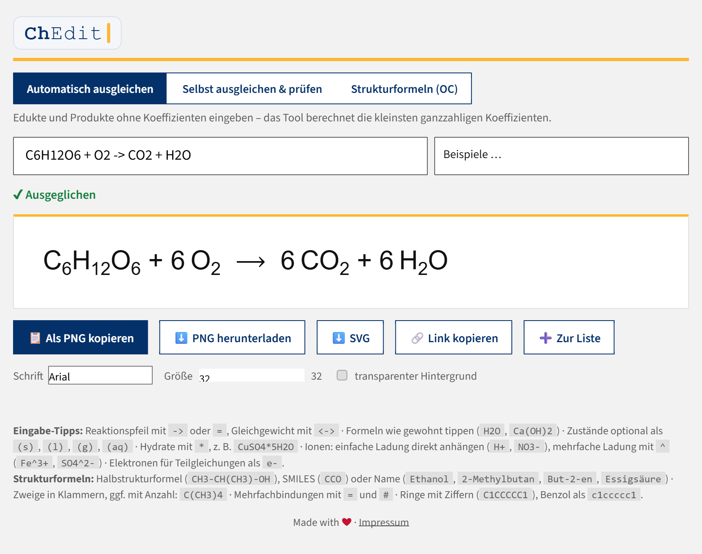

# ⚗️ Chemie-Formeleditor

Ein kleines Web-Tool zum Erstellen und Prüfen von chemischen Reaktionsgleichungen
und einfachen organischen Strukturformeln, z. B. für Arbeitsblätter.
Kernstück ist [index.html](index.html) plus der Ordner `assets/` (Logo und Schrift) –
keine Installation, keine Abhängigkeiten, kein Server nötig.



Das Design folgt dem **FAU-Corporate-Design** (FAU-Blau `#04316a`, Phil-Fak-Gelb `#fdb735`)
und passt damit optisch zu https://www.chemiedidaktik.phil.fau.de/. Im Header steht links
das **ChEdit-Logo** (Variante 1e „Editor-Caret“: der Schriftzug tippt sich beim Laden
selbst ein, der gelbe Cursor blinkt; bei `prefers-reduced-motion` statisch) und rechts
das Lehrstuhl-Logo, verlinkt auf die Lehrstuhl-Website. Eine statische SVG-Fassung des
ChEdit-Logos liegt unter `assets/logo-chedit.svg` (z. B. für Favicon oder Druck).

**DSGVO:** Das Tool lädt zur Laufzeit **keine externen Ressourcen**. Die Schrift
„Source Sans 3“ (freie Schrift, SIL Open Font License) und das Logo liegen lokal in
`assets/` – kein Google-Fonts-CDN, keine Tracker, keine Cookies. Beim Hochladen den
`assets/`-Ordner mitkopieren.

> **Hinweis zu diesem Repository:** Nicht enthalten sind das geschützte
> **FAU-/Lehrstuhl-Logo** (`assets/logo-chemiedidaktik.svg`), die lokale Hilfsdatei
> `start-lokal.bat` und die server-spezifischen `oembed.*`-Dateien. Schrift und
> ChEdit-Logo (im Ordner `assets/`) sind dabei, das Tool läuft also direkt. Für die
> FAU-Version einfach ein eigenes `assets/logo-chemiedidaktik.svg` ergänzen – fehlt die
> Datei, blendet der Header diesen Logo-Platz automatisch aus (kein kaputtes Bild).

## Funktionen

- **Automatisch ausgleichen**: Edukte und Produkte eingeben (`CH4 + O2 -> CO2 + H2O`),
  das Tool berechnet die kleinsten ganzzahligen Koeffizienten (exakte Bruchrechnung, Gauß-Verfahren).
- **Selbst ausgleichen & prüfen**: Gleichung mit eigenen Koeffizienten eingeben
  (`2 H2 + O2 -> 2 H2O`), das Tool zeigt pro Element die Atomanzahlen links/rechts – gut als Übung.
- **Strukturformeln (OC)**: Einfache organische Moleküle als **Skelettformel** oder mit
  **ausgeschriebenen C und H** zeichnen lassen. Eingabe als Halbstrukturformel
  (`CH3-CH(OH)-COOH`), SMILES (`CCO`, `c1ccccc1`) **oder deutscher Name**
  (`Ethanol`, `2-Methylbutan`, `But-2-en`, `Propan-2-ol`, `Essigsäure`, `Cyclohexan` –
  systematische Nomenklatur mit Substituenten, Mehrfachbindungen, -ol/-al/-on/-säure/-amin
  sowie gängige Trivialnamen). Das Tool zeigt die Summenformel an
  und warnt didaktisch, wenn geschriebene H-Zahlen nicht zur Valenz passen
  (z. B. `CH2-CH3`). Bei ausgeschriebenen Strukturen ist die Geometrie umschaltbar:
  **Gewinkelt (120°)** wie in realistischen Darstellungen oder **Linear (90°)** wie in
  klassischen Schulbuch-Valenzstrichformeln (gerade Kette, H senkrecht).
- **Freie Elektronenpaare**: Bei ausgeschriebenen Strukturformeln optional zuschaltbar –
  Striche an O, N, S und Halogenen wie in der Valenzstrichformel üblich.
- **PNG- und SVG-Export**: Gleichung oder Strukturformel als hochauflösendes PNG in die
  Zwischenablage kopieren oder herunterladen – direkt in Word/Docs einfügbar. Zusätzlich
  SVG-Download (Vektorgrafik, verlustfrei skalierbar). Schriftart, Größe und transparenter
  Hintergrund einstellbar.
- **Arbeitsblatt-Modus**: Beliebig viele Gleichungen und Strukturen mit „➕ Zur Liste“
  sammeln (bleibt lokal im Browser gespeichert), sortieren, mit Titel versehen und als
  Druckseite/PDF ausgeben – mit Name/Klasse/Datum-Kopfzeile. Optionaler **Lückenmodus**
  lässt die Koeffizienten frei (`____ CH4 + ____ O2 → …`) und hängt auf Wunsch ein
  Lösungsblatt auf eigener Seite an.
- **3D-Modelle (JSmol)**: Im Strukturmodus öffnet „🧊 3D-Modell“ die mitgelieferte
  Viewer-Seite `3d.html` in einem **Popup-Fenster** (MOL-Datei wird per URL übergeben;
  erneute Klicks nutzen dasselbe Fenster). Die Geometrie wird von JSmol per Kraftfeld
  optimiert – ein Overlay verdeckt die Ansicht währenddessen, sodass direkt das
  **fertige Modell** erscheint. Exporte im Popup: **PNG** (Bild), **SVG** (Bild in
  SVG-Hülle, kein echter Vektor) und **MOL (3D)** – die optimierten 3D-Koordinaten
  für Avogadro, Chimera & Co. JSmol wird **erst beim Klick** geladen: bevorzugt aus dem
  lokalen Ordner `jsmol/` neben dem Tool, sonst von
  `https://intern.chemiedidaktik.fau.de/jsmol` (per `?jsmol=…` übersteuerbar) –
  DSGVO-konform, keine Drittanbieter.
  **Wichtig:** `3d.html` mit hochladen; Tool und JSmol sollten auf derselben Domain
  liegen. Technischer Hinweis im Code: `set minimizationRefresh false` darf nicht
  verwendet werden – es hält die Minimierung in JSmol komplett an.
- **Barrierefreiheit**: Die Vorschau trägt eine textliche Beschreibung (`aria-label`,
  z. B. „CH4 + 2 O2 → CO2 + 2 H2O“) für Screenreader, Statusmeldungen sind `aria-live`,
  Umschalter melden ihren Zustand (`aria-pressed`), sichtbarer Tastatur-Fokus.

### Eingabe-Syntax

| Eingabe | Bedeutung |
|---|---|
| `->` oder `=` | Reaktionspfeil → |
| `<->` oder `<=>` | Gleichgewichtspfeil ⇌ |
| `Ca(OH)2`, `Fe2O3` | Formeln wie gewohnt, Klammern erlaubt |
| `(s)`, `(l)`, `(g)`, `(aq)` | Aggregatzustände (optional, nach der Formel) |
| `CuSO4*5H2O` | Hydrate mit `*` |
| `H+`, `NO3-`, `e-` | einfach geladene Ionen und Elektronen: Ladung direkt anhängen |
| `Fe^3+`, `SO4^2-` | mehrfach geladene Ionen: Ladung mit `^` |

**Redox:** Ionengleichungen werden inklusive **Ladungsbilanz** ausgeglichen und geprüft,
z. B. `MnO4^- + Fe^2+ + H+ -> Mn^2+ + Fe^3+ + H2O`. Auch Teilgleichungen mit Elektronen
funktionieren: `Cr2O7^2- + H+ + e- -> Cr^3+ + H2O`. Im Prüfmodus erscheint die Ladung
als eigene Zeile in der Vergleichstabelle.

**Hinweis zur Schreibweise:** Mehrfachladungen immer mit `^` schreiben – `Fe3+` würde
als 3 Fe-Atome mit Ladung 1+ gelesen (das Tool zeigt dann einen Tipp an).

### Eingabe-Syntax Strukturformeln

| Eingabe | Bedeutung |
|---|---|
| `CH3-CH2-OH` oder `CCO` | Ketten als Halbstrukturformel oder SMILES |
| `CH3-CH(CH3)-CH3`, `C(CH3)4` | Zweige in Klammern, optional mit Anzahl |
| `CH2=CH2`, `HC#CH` | Doppel-/Dreifachbindung mit `=` / `#` |
| `C1CCCCC1`, `c1ccccc1` | Ringe über Ringziffern (auch `%nn`), Benzol klein geschrieben |
| `c1ccncc1`, `c1ccoc1`, `c1cc[nH]c1` | Heteroaromaten: Pyridin, Furan, Pyrrol, Thiophen |
| `[NH4+]`, `[O-]`, `CC(=O)[O-]` | Ionen/Ladungen und explizite H in eckigen Klammern |
| `[Na+].[Cl-]` | getrennte Teilchen mit `.` |
| `COOH`, `CHO`, `CO`, `NH2`, `OH`, `CN` | erkannte funktionelle Gruppen |

Die Summenformel zeigt bei Ionen die **Netto-Ladung** an; in der Skelettformel werden
Ladungen hochgestellt am Atom dargestellt.

**Grenzen der 2D-Zeichnung:** ein Ring pro Molekül und keine getrennten Fragmente – solche
Strukturen (z. B. Naphthalin, Salze) werden **nicht** als 2D-Skelettformel gezeichnet, sind
aber als **Summenformel** und **3D-Modell** verfügbar. Keine Stereochemie. Unterstützte
Elemente in der 2D-Darstellung: C, H, N, O, S, P und Halogene (weitere via `[…]` für Formel/3D).

## Nutzung

Datei einfach im Browser öffnen (Doppelklick auf `index.html`) – funktioniert auch offline.

**Ausnahme 3D-Ansicht:** JSmol kann unter `file://` (Doppelklick) aus Browser-Sicherheitsgründen
nicht laden. Zum lokalen Testen deshalb **`start-lokal.bat`** doppelklicken – sie startet einen
Mini-Webserver (Python) und öffnet das Tool unter `http://localhost:8124`. Auf dem Webserver
läuft die 3D-Ansicht ohne Weiteres.

## In eine Website einbinden

**Variante 1 – iframe** (empfohlen): `index.html` auf den Webspace hochladen und einbetten:

```html
<iframe src="/pfad/zu/index.html" width="100%" height="560"
        style="border:none; border-radius:12px;"></iframe>
```

**Variante 2 – direkt integrieren**: Den Inhalt von `<style>`, dem `<div class="app">`
und `<script>` in die eigene Seite kopieren.

> Hinweis: Das Kopieren in die Zwischenablage (Clipboard API) funktioniert nur über
> **HTTPS** oder `localhost`. Der Download-Button funktioniert immer.

## URL-Parameter & Link teilen

Das Tool lässt sich mit einer vorbelegten Gleichung öffnen:

```
index.html?eq=CH4%20%2B%20O2%20-%3E%20CO2%20%2B%20H2O&mode=check
```

- `eq` – die Gleichung bzw. Strukturformel (URL-kodiert; der Button **„🔗 Link kopieren“**
  im Tool erzeugt solche Links automatisch)
- `mode` – `check` für den Prüfmodus, `struct` für Strukturformeln, sonst automatisches Ausgleichen
- `stil` – `voll` für ausgeschriebene C und H im Strukturmodus (sonst Skelettformel)
- `form` – `linear` für die 90°-Schulbuch-Geometrie (nur zusammen mit `stil=voll`)
- `ep` – `1` blendet freie Elektronenpaare ein (nur zusammen mit `stil=voll`)

## oEmbed-Schnittstelle ([oembed.com](https://oembed.com/))

Damit können oEmbed-fähige Plattformen (WordPress, Moodle mit oEmbed-Filter, …) das Tool
automatisch einbetten, wenn man dort nur den Link einfügt. **Voraussetzung:** Das Tool ist
öffentlich unter einer festen HTTPS-Adresse gehostet – mit `localhost` oder einer lokalen
Datei funktioniert oEmbed nicht.

### Einrichtung

1. Alle Dateien auf den Webspace hochladen, z. B. nach `https://deine-schule.de/chem-tool/`.
2. Den Platzhalter `https://DEINE-DOMAIN.example/chem-tool/` durch die echte Adresse ersetzen, und zwar in:
   - `index.html` (der `<link rel="alternate" …>` Discovery-Tag im `<head>`)
   - `oembed.php` (Variable `$base`) **oder** `oembed.json` (beide URLs)

### Zwei Varianten

| Datei | Voraussetzung | Verhalten |
|---|---|---|
| `oembed.php` (empfohlen) | Hosting mit PHP | Dynamisch: bettet auch Links mit konkreter Gleichung (`?eq=…`) ein, unterstützt `maxwidth`/`maxheight` und `format=json/xml` |
| `oembed.json` | beliebiges statisches Hosting | Fest: liefert immer denselben iframe auf die Startseite |

Bei der statischen Variante im Discovery-Tag in `index.html` einfach `oembed.json` als
`href` eintragen.

### Hinweise zu Plattformen

- **WordPress** nutzt oEmbed-Discovery aus Sicherheitsgründen nur für Autoren mit der
  Berechtigung `unfiltered_html`. Zuverlässiger ist es, den eigenen Endpoint im Theme
  (functions.php) zu registrieren:
  ```php
  wp_oembed_add_provider('https://deine-schule.de/chem-tool/*',
                         'https://deine-schule.de/chem-tool/oembed.php');
  ```
- **Moodle** braucht das oEmbed-Filter-Plugin.
- Plattformen ohne oEmbed: einfach das iframe-Snippet von oben verwenden.

## Repository klonen / Entwicklung

Das Tool besteht im Kern aus statischen Dateien – kein Build-Schritt nötig.

```bash
git clone https://github.com/f1nkster/chedit.git
cd chedit
```

Für die 3D-Ansicht ist zusätzlich **JSmol** nötig. Es ist bewusst **nicht** im Repo
enthalten (Drittsoftware, ~100 MB). Zum lokalen Testen JSmol von
<https://jsmol.sourceforge.net/> herunterladen und den Ordner als `jsmol/` neben
`index.html` legen, dann `start-lokal.bat` doppelklicken (startet einen lokalen
Webserver – nötig, weil Browser JSmol unter `file://` blockieren). Auf einem Webserver
mit vorhandener JSmol-Installation genügt der Fallback bzw. der Parameter `?jsmol=…`.

## Lizenz & Danksagungen

Der Quellcode steht unter der [MIT-Lizenz](LICENSE) – frei nutzbar, anpassbar und
weitergebbar. Für die mitgelieferten Logos (FAU / Lehrstuhl), die Schriftart
(Source Sans 3, SIL OFL) und das extern eingebundene JSmol (LGPL) gelten eigene
Bedingungen; Details in [NOTICE.md](NOTICE.md).
